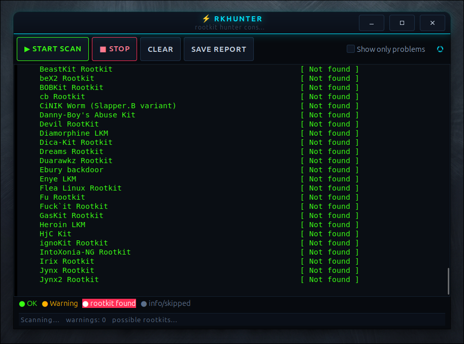

# rkhunter-gui


-lightgrey.svg)


A friendly **GTK3** front-end for [`rkhunter`](https://rkhunter.sourceforge.net/)
(Rootkit Hunter) — runs `rkhunter --check` and shows the scan live, in a window,
**with colors**, instead of a long monochrome terminal dump.

## Screenshot



`rkhunter` is thorough but its terminal output is awkward: it pauses for `<ENTER>`
between sections, prints hundreds of `[ OK ]` lines, and the *details* of any
warning go only to a log file. This program smooths all of that over.

## Features

- **Live output** — each line appears as `rkhunter` produces it.
- **Color-coded status tags** (parsed from the trailing `[ ... ]`):
  - 🟢 **green** — `OK`, `Not found`, `None found`, `Clean`, `Not affected`, `Found`
  - 🟡 **yellow** — `Warning`, `Update available`
  - 🔴 **red** — a genuine detection (`Possible rootkits: N` with N > 0)
  - 🔵 **blue** — section headers (`Checking system commands...`)
  - ⚪ **gray** — informational / skipped detail
- **"Show only problems"** checkbox — `rkhunter` emits hundreds of passing checks;
  tick this to hide them and see only warnings, detections, section headers and the
  summary. It reports how many lines were hidden, e.g.
  *"ℹ 245 passed/info line(s) hidden"*.
- **Authoritative counts** — the status bar shows warnings and possible-rootkit
  totals taken from `rkhunter`'s own summary, not a guess.
- Handles `rkhunter`'s quirks automatically:
  - `--skip-keypress` so it never pauses for `<ENTER>`,
  - `--nocolor` so the GUI applies its own colors,
  - finds the `rkhunter` binary even when it lives in `sbin`.
- **Stop**, **Clear**, and **Save report…** buttons.
- Application icon + window/taskbar icon and a desktop menu entry.

## Asks for the password automatically

`rkhunter` needs root. When you launch `rkhunter-gui` as a normal user (e.g. from
the application menu), it **re-launches itself through `pkexec`** up front, so you
get a graphical password dialog without needing a terminal. The display
environment (`DISPLAY` / `XAUTHORITY` / `WAYLAND_DISPLAY` / `XDG_RUNTIME_DIR`) is
forwarded so the window appears correctly on both **X11 and Wayland**.

If you cancel the dialog (or `pkexec` is unavailable) it falls back to running as
your user and elevates each individual scan instead.

## Requirements

- GTK 3 development files — `sudo apt install libgtk-3-dev`
- `pkexec` (from `policykit-1`, normally already installed)
- A C compiler and `make`
- `rkhunter` — **bundled** with this project (see below); installed automatically
  if missing.

## Build

```bash
make
```

## Run

```bash
make run          # build + run from this directory
# or, after installing:
rkhunter-gui
```

Click **Start scan**.

## Install / Uninstall

```bash
sudo make install     # installs rkhunter (if missing) + the GUI, icon and menu entry
sudo make uninstall   # removes the GUI (leaves rkhunter in place)
```

### Bundled rkhunter

`rkhunter` was removed from recent Debian/Ubuntu repositories, so the upstream
source tarball (`rkhunter-1.4.6.tar.gz`) ships alongside this project. `make
install` runs the `install-rkhunter` step first:

- if `rkhunter` is already on the system → it is left untouched;
- otherwise the bundled tarball is extracted and installed, and its file-property
  database is seeded with `rkhunter --propupd`.

`make install` puts:

| File | Destination |
|------|-------------|
| `rkhunter-gui` | `/usr/local/bin/` |
| `rkhunter-gui.svg` | `/usr/local/share/icons/hicolor/scalable/apps/` |
| `rkhunter-gui.desktop` | `/usr/local/share/applications/` |

After installing, the program appears in your application menu under
**System / Security**.

## Files

| File | Purpose |
|------|---------|
| `rkhunter-gui.c` | The program (C / GTK3) |
| `Makefile` | Build, `run`, `install`, `uninstall`, `install-rkhunter` targets |
| `rkhunter-gui.svg` | Application / window icon |
| `rkhunter-gui.desktop` | Application menu launcher |
| `rkhunter-1.4.6.tar.gz` | Bundled rkhunter source, installed on demand |

## Understanding "Possible rootkits: N"

This is the single most misread part of `rkhunter`'s output: **it does not mean
N named rootkits were found.** It is an internal counter of all warning-worthy
findings, and a single on-screen `[ Warning ]` often expands into several items.
On a normal desktop these are almost always benign false positives — for example:

- `/usr/bin/lwp-request` "replaced by a script" → it's a normal Perl tool,
- suspicious file types in `/dev` → modern systemd places non-device files there,
- hidden files/dirs like `/etc/.java`, `/etc/.updated`, `.resolv.conf...bak`.

The on-screen output only shows `[ Warning ]` on the check line; the specific
files that triggered each warning are written to **`/var/log/rkhunter.log`**:

```bash
sudo grep "Warning:" /var/log/rkhunter.log
```

## License

MIT.
